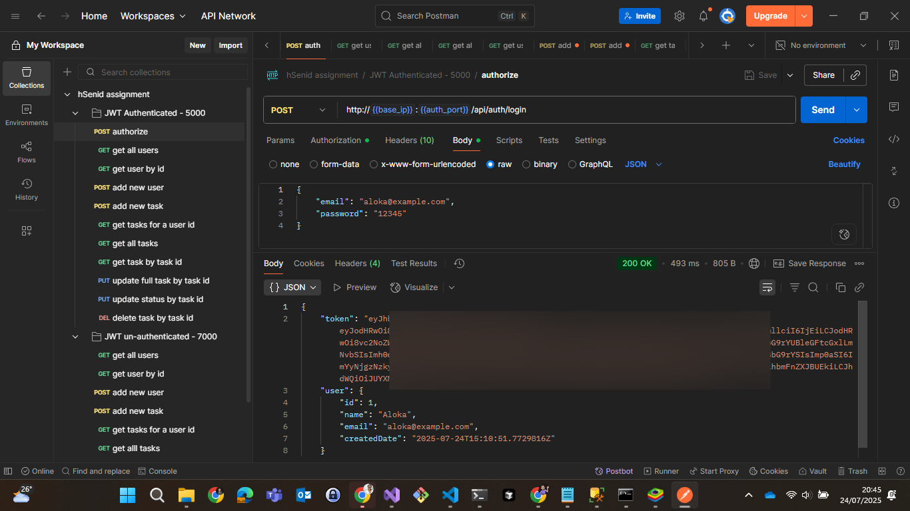

# Task Management Mobile & Web Application

A comprehensive task management system built with .NET MAUI mobile app, Vue.js frontend, and .NET Web API backend with SQL Server database.

## Project Overview

This project fulfills all requirements for a full-stack task management application:
- **Database**: SQL Server with raw SQL queries (no Entity Framework)
- **Backend**: .NET Web API with ADO.NET and dependency injection
- **Frontend**: Vue.js 2 with Options API
- **Mobile**: .NET MAUI app with WebView integration
- **Authentication**: JWT-based authentication system (optional backend)

## Project Structure

```
Task-Management-Mobile-Web-Application/
├── backend-7000/                    # Main backend (no authentication)
├── backend-JWT-Authenticated/       # JWT authenticated backend
├── frontend/                        # Vue.js web application
├── PeopleTaskMobile/               # .NET MAUI mobile application
├── supabase/                       # Database migration scripts
├── Postman/                        # API testing screenshots
└── README.md
```

## Requirements Completed

### Part 1: Database Setup - COMPLETED
- Users table (Id, Name, Email, CreatedDate)
- Tasks table (Id, Title, Description, Status, UserId, CreatedDate, DueDate)
- Raw SQL scripts (no Entity Framework)
- XML configuration files for queries
- Separate connection string configuration

### Part 2: .NET Web API - COMPLETED
- GET /api/users - Get all users
- POST /api/users - Create new user
- GET /api/tasks/{userId} - Get tasks for a user
- POST /api/tasks - Create new task
- PUT /api/tasks/{id} - Update task status
- DELETE /api/tasks/{id} - Delete task
- ADO.NET for database operations
- SQL queries stored in XML files
- Proper error handling and HTTP status codes
- Dependency injection for database connections

### Part 3: Vue.js Frontend - COMPLETED
- User selection dropdown
- Task list display (Pending, In Progress, Completed)
- Add new task form
- Edit task status functionality
- Delete task option
- Vue 2 with Options API
- API error handling
- Basic responsive design
- Form validation

### Part 4: .NET MAUI Mobile App - COMPLETED
- WebView displaying Vue.js application
- Native navigation between WebView and native pages
- Native splash screen
- WebView loading states handling
- Android platform support
- Proper WebView configuration
- Back button navigation handling
- Network error handling

### Additional Features - COMPLETED
- **Task Filtering**: Filter tasks by user (tasks per user)
- **JWT Authentication**: Separate authenticated backend for testing
- **Native Page**: Additional native page with navigation

## Setup and Installation

### Prerequisites
- Visual Studio 2022 with .NET MAUI workload
- Node.js (v16 or higher)
- SQL Server LocalDB
- .NET 6.0 or higher

### Database Setup

1. **Create Database:**
   ```sql
   -- Use SQL Server Management Studio or Visual Studio
   -- Connect to: (localdb)\MSSQLLocalDB
   -- Run the migration script:
   ```

2. **Run Migration Script:**
   ```bash
   # Execute the SQL script located at:
   \supabase\migrations\20250721094209_rustic_spire.sql
   ```

### Backend Setup (Non-Authenticated)

1. **Navigate to backend directory:**
   ```bash
   cd backend-7000
   ```

2. **Update connection string** in `appsettings.json`:
   ```json
   {
     "ConnectionStrings": {
       "DefaultConnection": "Server=(localdb)\\MSSQLLocalDB;Database=TaskManagerDB;Trusted_Connection=true;"
     }
   }
   ```

3. **Run the backend:**
   ```bash
   dotnet run --urls "http://0.0.0.0:7000"
   ```

4. **Test API endpoint:**
   ```
   GET http://YOUR_IP:7000/api/users
   ```

### JWT Authenticated Backend (Optional)

1. **Navigate to JWT backend:**
   ```bash
   cd backend-JWT-Authenticated
   ```

2. **Run the authenticated backend:**
   ```bash
   dotnet run --urls "http://0.0.0.0:5000"
   ```

3. **Test with Postman:**
   - Email: `aloka@example.com`
   - Password: `12345`
   - 

### Frontend Setup

1. **Navigate to frontend directory:**
   ```bash
   cd frontend
   ```

2. **Install dependencies:**
   ```bash
   npm install
   ```

3. **Update IP addresses** in the following files:

   **vite.config.js:**
   ```javascript
   server: {
     proxy: {
       '/api': 'http://YOUR_IP:7000'
     }
   }
   ```

   **api.ts:**
   ```typescript
   const API_BASE_URL = 'http://YOUR_IP:7000/api';
   ```

4. **Run the frontend:**
   ```bash
   npm run dev -- --host YOUR_IP
   # Example: npm run dev -- --host 172.20.10.5
   ```

### Mobile App Setup

1. **Open in Visual Studio:**
   ```
   Open PeopleTaskMobile.sln in Visual Studio 2022
   ```

2. **Update IP address** in `MainPage.xaml`:
   ```xml
   <WebView x:Name="webView" 
            Source="http://YOUR_IP:3000" />
   ```

3. **Build and run:**
   - Select Android emulator or device
   - Build and deploy the application

## Network Configuration

### Important: IP Address Updates Required

When changing network providers or IP addresses, update the following files:

1. **Mobile App** - `PeopleTaskMobile/MainPage.xaml`:
   ```xml
   Source="http://YOUR_NEW_IP:3000"
   ```

2. **Frontend** - `vite.config.js`:
   ```javascript
   proxy: { '/api': 'http://YOUR_NEW_IP:7000' }
   ```

3. **Frontend** - `api.ts`:
   ```typescript
   const API_BASE_URL = 'http://YOUR_NEW_IP:7000/api';
   ```

## Development Notes

### Running Multiple Services
1. **Database**: SQL Server LocalDB (always running)
2. **Backend**: Port 7000 (main) or 5000 (JWT)
3. **Frontend**: Port 3000 (or your IP)
4. **Mobile**: Emulator or physical device


## Testing

### API Testing
- **Endpoint**: `http://YOUR_IP:7000/api/users`
- **Method**: GET
- **Expected**: JSON array of users

### JWT Authentication Testing
- **Endpoint**: `http://YOUR_IP:5000/api/auth/login`
- **Credentials**:
  - Email: `aloka@example.com`
  - Password: `12345`
- **Postman Collection**: Available in `/Postman/` directory

## Mobile App Features

### Native Features Implemented:
- **Native Page**: Additional native page with navigation
- **WebView Integration**: Seamless Vue.js app integration
- **Back Button Handling**: Proper navigation management
- **Loading States**: Visual feedback during WebView loading
- **Error Handling**: Network connectivity error management

### Navigation Flow:
1. Splash Screen → Main Page
2. WebView (Vue.js App) ↔ Native Page
3. Back button support throughout

## Additional Features

### Task Filtering by User
- **Implementation**: Filter tasks according to selected user
- **Usage**: Select user from dropdown to view their specific tasks
- **Benefit**: Enhanced user experience and data organization

### JWT Authentication System
- **Purpose**: Secure API testing and future authentication needs
- **Testing**: Available via Postman with provided credentials
- **Integration**: Separate backend for authenticated operations


## Technologies Used

- **Backend**: .NET 6 Web API, ADO.NET, SQL Server
- **Frontend**: Vue.js 2, Vite, TypeScript, Tailwind CSS
- **Mobile**: .NET MAUI, WebView, Android
- **Database**: SQL Server LocalDB
- **Authentication**: JWT (optional backend)
- **Testing**: Postman


## License

This project is developed as a Software Engineering Intern Assignment for a Task Management Mobile & Web Application.

**Note**: Remember to update IP addresses when switching networks or development environments. All services must be accessible on the same network for proper functionality.
